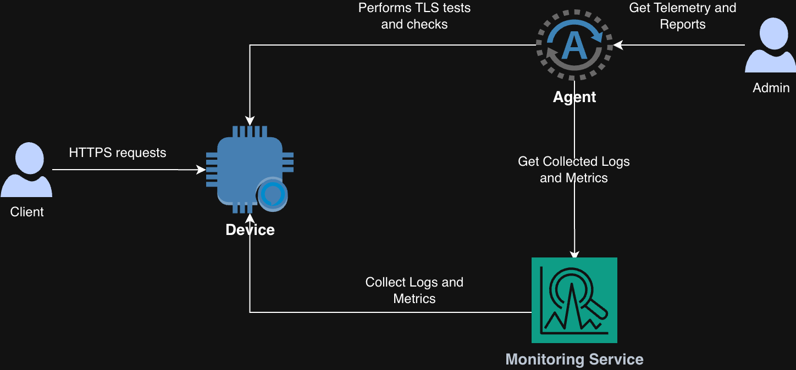
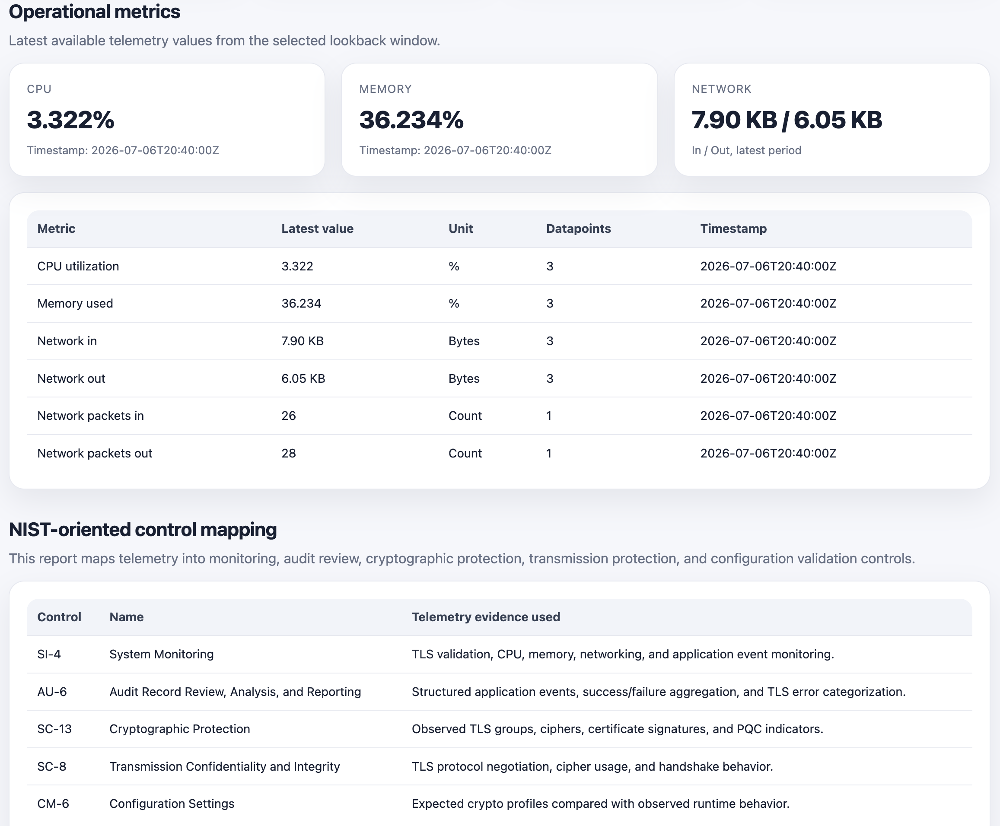
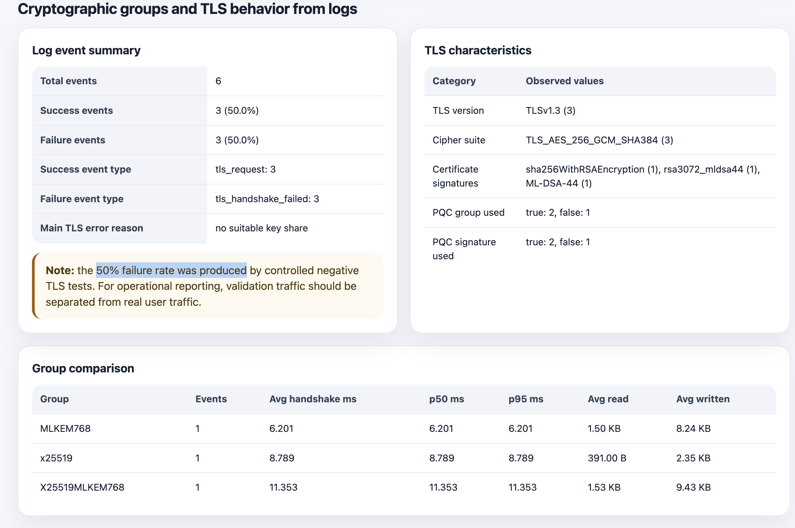

# PQC TLS Crypto-Agility Platform

This repository contains an implementation of Post-Quantum Cryptography (PQC) based on the principles of crypto-agility, combined with telemetry capabilities and aligned with NIST standards and recommendations.

The service is implemented in C++ using OpenSSL, the OpenSSL EVP high-level cryptographic API, and liboqs, enabling the integration and evaluation of both classical and post-quantum cryptographic algorithms.

The project includes automated pipelines that orchestrate the entire workflow, including:

- **Infrastructure as Code (IaC)** with Terraform
- **Container image build** with Docker
- **Policy as Code (PaC)** with Open Policy Agent (OPA) and Rego
- **Validation, testing, telemetry, and reporting** using Python scripts.
- **CI/CD pipelines** using Github Actions.

---

# Architecture Overview

The solution consists of the following components:

- **Device:** Amazon EC2 instance
- **Monitoring Service:** Amazon CloudWatch
- **Agent:** GitHub Actions Runner executing Python scripts
- **Admin:** The authorized user who can view data, check reports, and manage responses.

<br>
<center></center>
<br>

- The EC2 instance runs the application inside Docker containers.
- Amazon CloudWatch collects logs and infrastructure metrics from the EC2 instance.
- Python scripts run TLS validation and tests directly on the device, collect telemetry through CloudWatch, and generate reports.

---

## Infrastructure as Code

The Terraform code provisions the complete infrastructure, including:

- EC2 Instance
- Amazon CloudWatch
- Amazon Elastic Container Registry (ECR)
- IAM Roles and Policies
- Security Groups
- Networking resources

---

## Containerization

The Docker image starts **three independent service instances**, each exposing a different TLS configuration to demonstrate the **crypto-agility** concept.

| Port | Configuration | Examples |
|------|---------------|----------|
| **8443** | Classical Cryptography | X25519, rsa3072, ecdsa_p256 |
| **8444** | Hybrid (Classical + Post-Quantum) | X25519MLKEM768, rsa3072_mldsa44, ecdsa_p256_slhdsa128 |
| **8445** | Post-Quantum Cryptography (PQC) | MLKEM768, mldsa44, SLH-DSA-SHA2-256 |

Although all three services execute the **same C++ application**, each instance uses a different `config.json` file to define its cryptographic configuration.

Example:

```json
{
  "app": {
    "listen_address": "0.0.0.0",
    "listen_port": 8444,
    "message": "hybrid RSA3072_MLDSA44 certificate with hybrid TLS group",
    "digest_algorithm": "SHA256",
    "cipher_algorithm": "AES-256-GCM"
  },
  "tls": {
    "certificate_file": "/app/certs/rsa3072_mldsa44/server.crt",
    "private_key_file": "/app/certs/rsa3072_mldsa44/server.key",
    "minimum_version": "TLSv1.3",
    "maximum_version": "TLSv1.3",
    "tls12_cipher_list": "ECDHE-RSA-AES256-GCM-SHA384:ECDHE-RSA-AES128-GCM-SHA256",
    "tls13_ciphersuites": "TLS_AES_256_GCM_SHA384:TLS_CHACHA20_POLY1305_SHA256:TLS_AES_128_GCM_SHA256",
    "groups": "X25519MLKEM768:X25519:P-256:P-384",
    "signature_algorithms": "rsa3072_mldsa44:mldsa44:RSA-PSS+SHA256:RSA-PSS+SHA384"
  },
  "logging": {
    "log_file": "/app/logs/rsa3072-mldsa44-hybrid.log"
  }
}
```

### Application Configuration

The **`app`** section defines the application's runtime configuration.
The selected digest and cipher algorithms are applied only to the application payload and are independent of the TLS configuration.

### TLS Configuration

The **`tls`** section defines the parameters used during the TLS handshake.
This configuration determines how secure connections are established between the client and the server.

---

## Policy as Code

Security policies are implemented using **Open Policy Agent (OPA)** and **Rego**.

Before the Docker image is built, the pipeline validates every `config.json` file. The build is automatically blocked if any insecure configuration is detected, including:

- Weak TLS versions
- Weak digest algorithms
- Weak symmetric cipher algorithms
- Weak signature algorithms

This approach ensures that only configurations compliant with the project's security requirements are deployed.

---

## Telemetry

Python scripts perform automated TLS validation and telemetry collection.<br>
The application responds to HTTPS requests with structured JSON containing device, client, TLS, PQC, and certificate information.

```json
        "device": {
          "name": "43ddb597ab3a",
          "ip": "172.17.0.2"
        },
        "client": {
          "ip": "172.17.0.1"
        },
        "tls": {
          "version": "TLSv1.3",
          "cipher": "TLS_AES_256_GCM_SHA384",
          "group": "X25519MLKEM768",
          "handshake_duration_ms": 10.5494,
          "handshake_bytes": {
            "read": 1569,
            "written": 9653
          },
          "pqc": {
            "pqc_group_used": true,
            "pqc_signature": true
          },
          "certificate": {
            "signature_algorithm": "rsa3072_mldsa44",
            "public_key_algorithm": "rsa3072_mldsa44",
            "public_key_bits": 128,
            "days_to_expire": 364
          }
```


The telemetry process includes:

- TLS connectivity tests
- Certificate validation
- Negotiated TLS version
- Negotiated cipher suite
- Negotiated key exchange group
- Negotiated signature algorithm
- Log collection
- Infrastructure metrics collection
- Generation of structured telemetry in JSON format

After executing the TLS tests and collecting metrics, the final telemetry data is generated in JSON format.<br>
A separate script reads the telemetry JSON file and generates a human-friendly HTML report.

<br>
<center></center>
<br>

<br>
<center></center>
<br>


## Thresholds and Platform Responses

The following table presents example thresholds and the corresponding platform responses.
These checks are performed based on telemetry collected from the running application.

| Observability Stack | Metric / Signal (What we collect) | Threshold (What Bad looks like) | Problem | Platform Response (What we alert/act on) | Evidence Retention (What we keep for evidence) |
| :--- | :--- | :--- | :--- | :--- | :--- |
| **L1** | CPU Utilization | `> 80%` | Resource Exhaustion (PQC Math Stress) | Alert | 5-min OS process snapshot + CPU metrics log |
| **L1** | Memory Utilization | `> 80%` | Memory Leak / Buffer Overflow Risk | Alert | Heap memory allocation logs |
| **L2** | Handshake Error Rate | `> 30%` | Network Degradation / Malformed Packets | Alert | Edge packet capture (PCAP) snippet |
| **L2** | p95 Handshake Duration | `> 100 ms` | Network Overload / Fragmentation (PQC Keys) | Alert | Network latency metrics + TCP window logs |
| **L3** | Certificate Validity | `< 30 days` | Impending Unavailability | Alert | Certificate metadata and chain log |
| **L3** | Agent Keep-Alive | Missing for 2 consecutive runs | Subsystem / Collector Failure | Alert + Force Restart | Collector daemon error logs & systemd dump |
| **L3** | Application Status | Unreachable | Appliance Outage | Alert + Force Restart | Core dump file + Last 100 application events |
| **L3** | Cryptographic Agility / KEM | Weak / Legacy algorithms detected | Cryptographic Compromise | Alert + Block traffic to the application | Active configuration JSON + Handshake metadata |
| **L3** | Protocol Compliance | TLS version below TLS 1.3 detected | Downgrade Attack (NIST Non-Compliance) | Alert + Block traffic to the application | Complete TLS ClientHello/ServerHello payload |
| **L3** | Cipher Suite Compliance | Non-approved cipher suite detected | Policy Violation / Broken Cipher | Alert + Block traffic to the application | Cryptographic session log (Session ID & Cipher) |
| **L3** | TLS Failure Rate per Client | Same source generates `> 100` TLS failures within 5 min | DoS/DDoS via PQC Exhaustion | Alert + Block the source | Source IP, TLS error codes, and Firewall drop log |
| **L2/L3**| Request Rate per Client | Same source generates `> 100` requests within 1 min | Rate Limit Breach / Application DoS | Alert + Block the source | Source IP traffic volume logs + Blocked events |
<br>

# CI/CD Pipelines

The project uses three independent GitHub Actions workflows, each responsible for a specific stage of the deployment pipeline.

| Workflow | Description |
|----------|-------------|
| **1 - Infrastructure Deployment (Terraform)** | Provisions the complete cloud infrastructure, including networking, IAM roles, security groups, compute resources, and supporting services. |
| **2 - Security Validation, Image Build, and Push (Rego + Docker)** | Validates the application's cryptographic configuration using Policy as Code (OPA/Rego). If all security checks pass, the Docker image is built and pushed to the container registry. |
| **3 - Telemetry Collection and Report Generation (Python)** | Collects logs and metrics, performs TLS validation tests, generates telemetry in JSON format, and produces the final HTML report. |

## Required GitHub Configuration

Before running the workflows, configure the following GitHub repository variables and secrets.

Configure the following variables:

```text
AWS_REGION=<region>
AWS_GITHUB_OIDC_ROLE_ARN=arn:aws:iam::<account-id>:role/<role-name>
ECR_REPOSITORY=<repository-name>
SSH_ALLOWED_CIDR=<your-public-ip>/32
TLS_ALLOWED_CIDR=<your-public-ip>/32
```

Configure the following secrets:

```text
TF_STATE_BUCKET=<existing-s3-bucket-for-terraform-state>
TF_STATE_KEY=<path>/terraform.tfstate
EC2_KEY_PAIR_NAME=<existing-ec2-key-pair-name>
```

> **Note**
>
> - The S3 bucket used for the Terraform state must already exist.
> - The EC2 Key Pair must already exist in the selected AWS Region.
> - The IAM role specified by `AWS_GITHUB_OIDC_ROLE_ARN` must be configured to allow GitHub Actions authentication through OIDC.


# Future Improvements

- Deploy the application on **Kubernetes** to enable automated deployments, isolated environments (using separate Pods and Namespaces) and enhanced security controls
- Implement **SAST and SCA** for C++ and Python source repositories, alongside **DAST** for runtime vulnerability scanning.
- Replace the Python telemetry collector with a **Go implementation** to leverage lightweight goroutines for concurrent, high-performance TLS validation across thousands of endpoints with lower memory usage and a single portable binary.
<br><br>
## Author
Taynan Mina Muniz - Information Security Specialist (MSc)
* LinkedIn: https://www.linkedin.com/in/tmmuniz
* GitHub: https://github.com/tmmuniz


